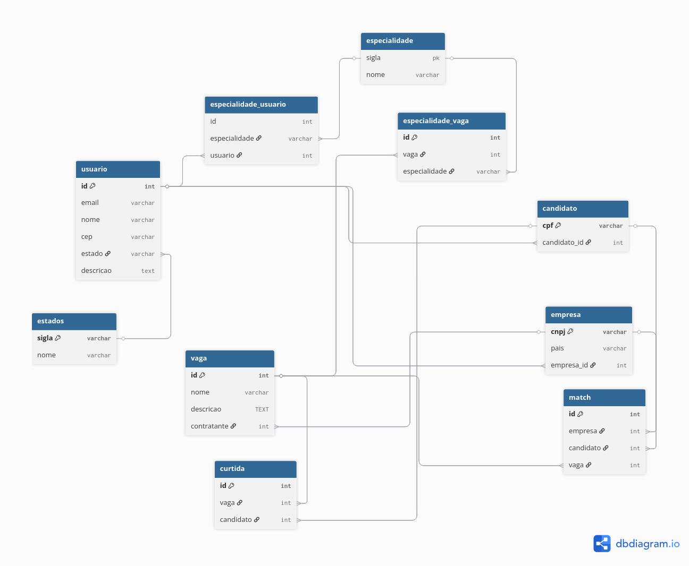

# MVP LikETinder

#Autor:Willian Carbone Bueno

 ##  sobre o projeto

- Sistema simulando uma plataforma de contratações as cegas com sistema CRUD de perfis, criação de vagas, curtidas e matchs

##  Tecnologias

- **Linguagem:** Groovy , Typescript
- **Persistencia:** Postgresql
- **FrontEnd** Html,Css,Webpack
- **BuilderToll** Gradle
- **Testes:** Spock

## execução projeto

- execute [Main.Groovy](app/src/main/groovy/Main.groovy),um menu em terminal te guiara pelas opções disponiveis

- execute [index.html](FrontEnd/src/telas/index.html) , para a versão em FRONTEND da aplicação

## Modelagem do banco

- O modelo foi desenvolvido utilizando a ferramenta [dbdiagram.io](https://dbdiagram.io/).

- O arquivo de criação das entidades e relacionamentos pode ser encontrado na pasta resources: [comandosCriacaoBancoDados.sql](app/src/main/resources/comandosCriacaoBancoDados.sql)

## Implementação Solid

- Implementação de interfaces
- CRUDS separados por categoria
- minimação de god classes

    

